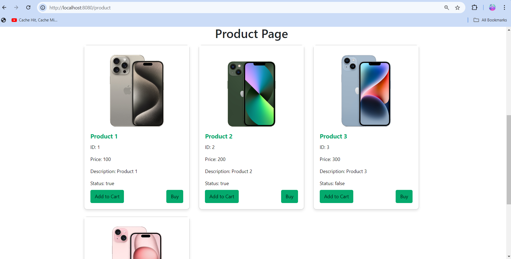

# Product List 

## Overview

The product list is a Spring Boot application that demonstrates a simple web-based product management system. It allows users to view a list of products and access detailed information about each product.

## Features

- View a list of products
- View detailed information for each product
- Built with Spring Boot and Thymeleaf for rendering views

## Technologies Used

- **Java**: Programming language
- **Spring Boot**: Framework for building web applications
- **Thymeleaf**: Template engine for rendering HTML views
- **Lombok**: Reduces boilerplate code using annotations
- **Gradle**: Build automation tool

## Getting Started

### Prerequisites

- Java Development Kit (JDK) 11 or higher
- Gradle for dependency management
- An IDE (e.g., IntelliJ IDEA, Eclipse)

### Installation

1. Clone the repository:

   ```bash
   git clone https://github.com/yourusername/webmvc2.git
   cd webmvc2
